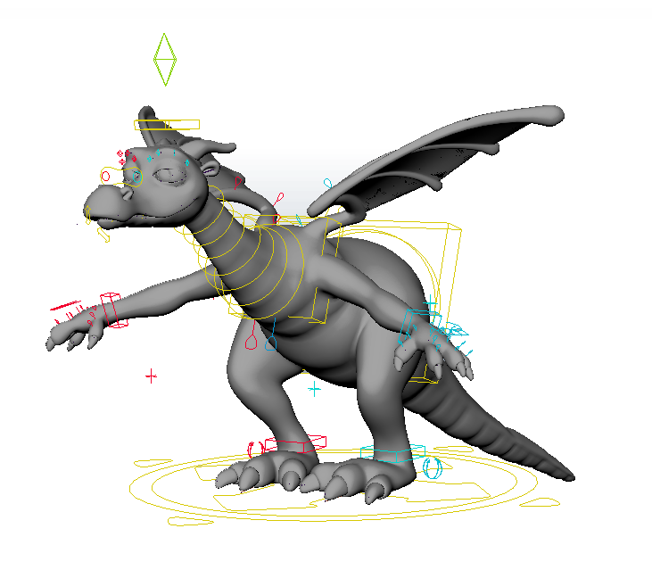

<!-- PROJECT LOGO -->
 

  
  <h3 align="center">Rig Forge Tool</h3>
  

<!-- ABOUT THE PROJECT -->
## About The Project

RF is a tool you can use within maya to autorig creatures and digidoubles. The tool uses a skeleton
to build upon and creates all controllers and functionality through a modifiable script. 

### Built With

